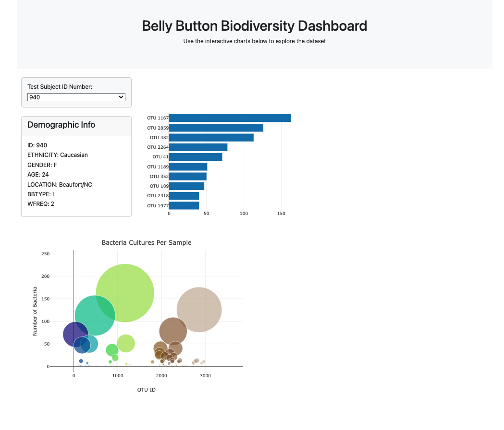

# Module-14-Interactive-Visualisations

## Introduction

Interactive visualisations were achieved using the [D3 Javascript](https://d3js.org/what-is-d3) Library and the [Plotly Javascript](https://plotly.com/javascript/) Library. The data source for this assignment originates from a Public Science project called the [Belly Button Biodiversity Project](https://robdunnlab.com/projects/belly-button-biodiversity/). A JSON version of this primary data has been provided for this assignment by Edx and is accessible from this [link](https://static.bc-edx.com/data/dl-1-2/m14/lms/starter/samples.json)

The assignment asks to build a dashboard using Javascript and sample data from the Belly Button Biodiversity Project. The output of this [dashboard](output/Bellybutton_Dashboard.html) is saved in the [output](output) folder. The HTML code file is called [index.html](index.html), and the Javascript file which creates the charts and interaction is saved in the [static](static) folder, and it is called [app.js](static/js/app.js) 

## Coding and Output

The code has been annotated with comments for clarity. The focus of the Javascript code was to pull data from a JSON file and convert it to an interactive webpage to review the data. The output in this assignment had a dropdown list to select test subjects and their relevant data has been displayed as a Table, Horizontal bar chart and bubble chart, as shown in the screenshot below:

